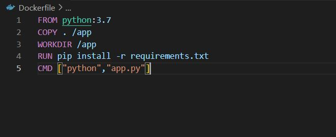
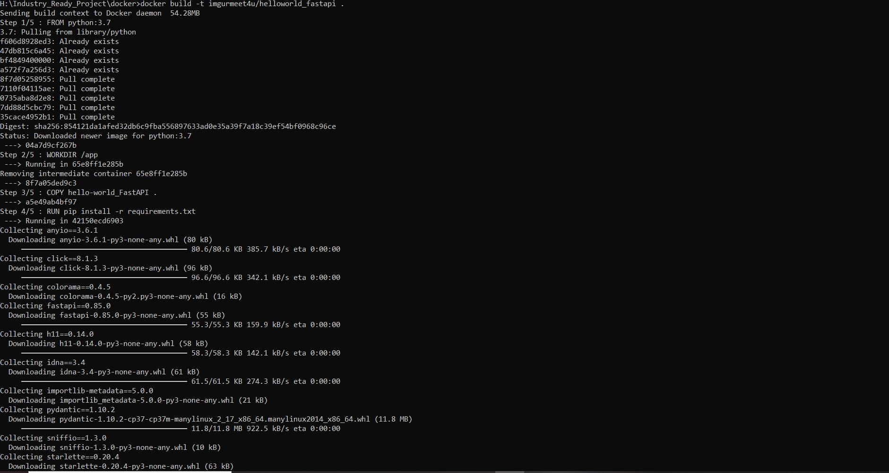
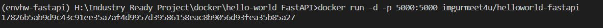
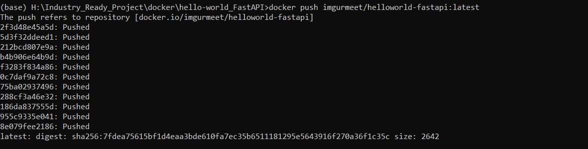

# Docker-Assignment3

## 1) Create a Dockerfile for your fastapi hello world application

 

## 2) Build Docker image using Docker file

 

## 3) Run docker image build 

 

## 4) Push your Docker image to Docker Hub

 

###############################################################################################################################################################
